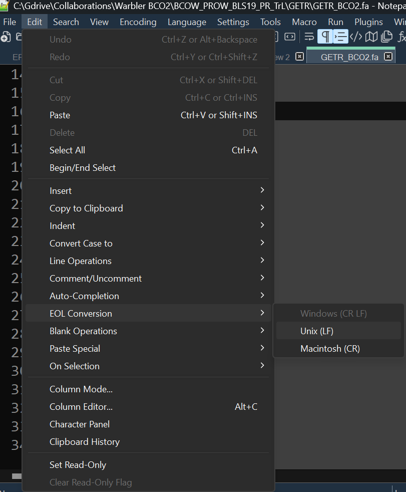
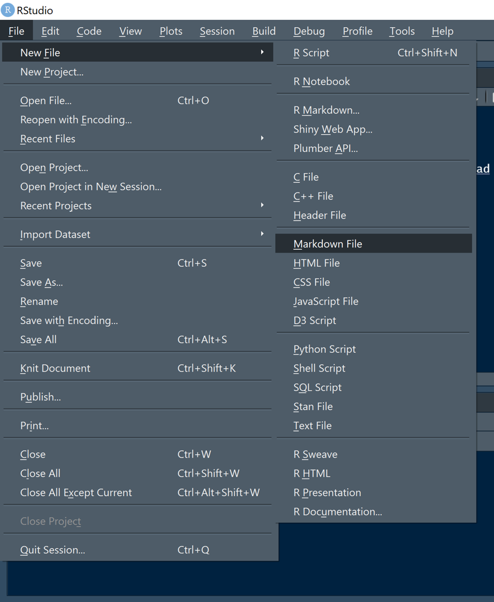

```{r setup, include=FALSE}
knitr::opts_chunk$set(echo = TRUE)
```
A major aim of Biol7263 is to introduce you to commonly used and freely available tools for sequence alignment, assembly, comparison, and manipulation. We will primarily use these tools remotely on the OU supercomputing center for education and research system - [OSCER](https://www.ou.edu/oscer). To access the OSCER we will need to setup a few programs on your computer.  

For seminar, you will need to **bring your own laptop computer** with the following software setup:

## Setup a terminal application

### Windows systems

If you have a newer windows system (Win10 or greater) you can access this OSCER using [Windows PowerShell](https://en.wikipedia.org/wiki/PowerShell). Look around, this should be installed on your system by default. 

To log into the OSCER you simply type: 
```
ssh [your username]@schooner.oscer.ou.edu
```
into the command line. You will then be prompted for you password. Note nothing appears at the cursor when you are entering you password. 

If you prefer a terminal application with more features you can install MobaXterm details available [here](https://www.ou.edu/oscer/support/machine_access).

## Mac systems

Similar to Windows, you can use the built-In terminal. You should be able to find this in your applications fold. Simply open it up and log into the OSCER by typing: 
```
ssh [your username]@schooner.oscer.ou.edu
```
into the command line. You will then be prompted for you password. Note nothing appears at the cursor when you are entering you password. 

The nice thing about Macs is that they are UNIX-based and so all of the commands we will learn for navigating the OSCER system can be used locally on your machine!

## File transfer

We will submit command to the OSCER through the terminal, but we will also need to load data and script files. There are [several options](https://www.ou.edu/oscer/support/file_transfer) to do this, I will use and suggest WInScp (for windows) and FileZilla (on Mac). Please select one and install it ahead of class.  

## Text/Script editor

I find it easiest to write and edit scripts locally in a standalone text editor and then upload to the OSCER.  There are many options, but the one I am most familiar with and will use in class is [Notepad++](https://notepad-plus-plus.org/downloads/). This resembles the basic windows notepad, but has a range of additional functions that are helpful to manage code and other text files. If you find another option you prefer, feel free to use that one. 

**Important Note for Windows users** Windows programs will often add hidden end of line characters that cause lots of trouble. When saving a file for upload to OSCER be sure to convert the line ends to unix. In Notepad++ this can be done here: 

{width=40%}

## Install R 

Follow this link: [http://lib.stat.cmu.edu/R/CRAN/](http://lib.stat.cmu.edu/R/CRAN/) and choose your platform (Windows, Mac, or Linux). The latest R version is: R 4.4.1 “Race For Your Life”.

- If you already have R and RStudio installed verify it is the latest version: it is listed at the top of the console when you open RStudio. If you would like to keep the packages in your library, check out this help page: https://www.r-bloggers.com/2017/05/upgrade-r-without-losing-your-packages/. For RStudio, go to Help -> check for updates.

- **For Windows**, click the “install R for the first time”, which is blue and bold next to “base.” Then ‘Download R 4.4.1 for Windows.’ If you download and install with the defaults, it will install both the 32 and 64 bit R
versions. You can delete the one that does not match with your processor.

- **For Mac**, choose the file that corresponds to your Mac OS X system version. If you have everything up to date, you can download and install 4.4.1 (just click and open the .pkg file).

- **For old Macs** (where you cannot update to the latest OS X software): Go to the same link https://lib.stat.cmu.edu/R/CRAN/ and click “Download for (Mac) OSX”. Scroll down and you will see a list of releases. Choose the .pkg file that corresponds to your software. If you have a version higher than 10.13 (High Sierra), you can choose the latest release.

## Install R studio

Go here: https://rstudio.com/products/rstudio/download/#download

- Choose and open the .exe file if you are a Windows user
- Choose and open the .dmg file if you are a Mac user

If you have an old Mac : here is a list of older versions - https://rstudio.com/products/rstudio/older-versions/

### Install R markdown

To setup Markdown in R, open Rstudio and then open a markdown file as shown below

```{r, out.width = "400px", echo=FALSE}

```

This should bring up a dialog asking if you want to install the required packages. Click yes. Once installed a dialog box should pop up asking you to name your markdown file. Go ahead close out of this. The required packages should now be installed. 

## Install Git

For this class we will implement and manage version control with git through R. To do this you will need git software. Please download and install git from [git-scm.com](https://git-scm.com). 

## Setup a github account 

We will use [GitHub](github.com) to archive and share assignments and class projects. If you do not yet have a github account, please sign up for a free, public account. 

### Link you github account in R studio

*Don't worry about this part now. We can do this together in seminar*

- To share material between your local computer and github you will need to link the account. To do this set your github email in RStudio (only once when you first commit) using this code and email and name you used to sign up for GitHub:

```{bash}
git config --global user.email "YOURNAME@utulsa.edu"
git config --global user.name "YOURNAME"
```

-  When you push for the first time it prompts you to log in (via a pop-up window)
  - You can choose ‘authorize on browser,’ log in, and click allow access

