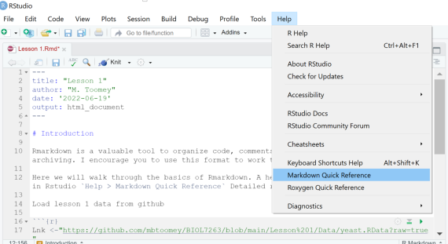

___

You can review the markdown file for this lesson here: https://mbtoomey.github.io/genome_biology_FA24/blob/main/Lessons/Lesson3.Rmd

# Introduction

Rmarkdown is a valuable tool to organize code, comments, and output for communication and archiving. I encourage you to use this format to work through our lessons and take notes. 

Here we will walk through the basics of Rmarkdown. A helpful quick references is available in Rstudio `Help > Markdown Quick Reference`:



A more detailed reference is available at the [rmarkdown cookbook](https://bookdown.org/yihui/rmarkdown-cookbook/).


### File types

- `.Rmd` is Rstudio's secific formulation of Markdown (a text rendering language)
- `.md` is the more generic Markdown file type. In RStudio, the intermediate `.md` files are not (in the default state) preserved.This is the format of your "readme" file on GitHub.

### Basic text formatting
- headers `#` to `######`
    *numbering from options
- text
- markup
    * italic `*<text>*`
    * bold-face `**<text>**`
    * subscript `~<text>~`
    * superscript `^<text>^`
    * strikethrough `~~<text>~~`
    * quotations `><text with no closing mark`
    
### Spacing
- Regular text is single spaced
- double spacing sets a line break (or carriage return)
    
### Insert links and images   
- links 

```
[Dr. Toomey's website](http://mbtoomey.net)
```
[Dr. Toomey's website](http://mbtoomey.net)

- images 
```

```


### Lists 

#### unordered list
```
- Finches
- Sparrows
    - House sparrow
    - Tree sparrow
```    
For second level list items "-" is preceeded by two spaces

- Finches
- Sparrows
    - House sparrow
    - Tree sparrow


#### Order lists  
```    
1. Finches
2. Sparrows
    - House sparrow
    - Tree sparrow
```    
1. Finches
2. Sparrows
    - House sparrow
    - Tree sparrow
    
# Fencing
```
Anything surrounded by backticks `will render as plain text` 
```
Anything surrounded by backticks `will render as plain text` 
```{r eval=FALSE}
R code inside ticks can be executed during rendering. For example, you can caluclate a value `r 3 + pi`. 
```
R code inside ticks can be executed during rendering. For example, you can caluclate a value `r 3 + pi`.

You can create a whole block of plain text by surrounding it with three backticks

```
everything is plain text here.
even single lines

Useful for show blocks of codes
```

# Block quotes with `>`

```
> Whether I shall turn out to be the hero of my own life, or whether that station will be held by anybody else, these pages must show.
```

> Whether I shall turn out to be the hero of my own life, or whether that station will be held by anybody else, these pages must show.

# Spacer line with three or more underscores
```
___   
```

___
# Tables

```
| Species  | Awesomeness
| :------------- | :-------------
| House Sparrow   | Medium|
| Tree Sparrow  | High|
```

| Species  | Awesomeness
| :------------- | :-------------
| House Sparrow   | Medium|
| Tree Sparrow  | High|

The "-" separates the header from the rest of the column
The ":" set the justification


### Equations

* in-line `$`
* centered `$$`

- basic math and text spacing handled by LateX. Note that this language is a bit different than the basic markdown (e.g. how sub and superscripts are handled)

```
$$y = a + b$$
```

$$y = a + b$$

#### Subcripts

```
$$H_0 = Z_{a + b}$$
```

$$H_0 = Z_{a + b}$$

#### Superscripts

```
$$S = cA^z$$

```

$$S = cA^z$$


- elements can be coupled and nested

$$S=cA^z_1 + z_{2 + x}$$


```
$$S=cA^z_1 + z_{2 + x}$$

```

#### Fractions and Greek Symbols

$$\alpha = \frac{\beta}{\delta + \gamma_x}$$
```
$$\alpha = \frac{\beta}{\delta + \gamma_x}$$

```

#### Summation signs

$$z = \sum_{i=1}^X{K}$$

```
$$z = \sum_{i=1}^X{K}$$

```

#### What is you need a backslash in your equation? 

Use `\backslash`

```
$$\backslash \alpha \le b \backslash$$

```

$$\backslash \alpha \le b \backslash$$

#### Rendering plain text in a LaTex Equation

$$P(Expression of gene) = Z$$
```
$$P(Expression of gene) = Z$$
```

$$P(\mbox{Expression of gene}) = Z$$

```
$$P(\mbox{Expression of gene}) = Z$$

```

## R code blocks 

- initiate with keyboard command `ctrl+alt+i`


```{r}
Lnk <-"https://github.com/mbtoomey/Biol_7263/blob/main/Data/yeast.Rdata?raw=true"
download.file(Lnk, "yeast.Rdata", mode = "wb")
load("yeast.Rdata")
```


This will load a dataframe called **yeast** that is taken from figure 2 of:

Shen, X., S. Song, C. Li, and J. Zhang (2022). Synonymous mutations in representative yeast genes are mostly strongly non-neutral. Nature:1–7.

We can peek at the data with `head(yeast)`. 

```{r}
head(yeast)
```

## Explore the data

We can begin to work with the dataset. Lets calculated a mean of fitness 

```{r}
mean(yeast$Fitness)
```

This fails because the data type of Fitness was classified as character. Let's fix this. 

```{r}
yeast$Fitness<-as.numeric(yeast$Fitness)
```

Let's try agian

```{r}
mean(yeast$Fitness)
```

There are missing vaues in the dataset (NAs) that R doesn't know what to do with. Let's get rid of those for now. (Note this might not always be a wise approach!!)

```{r}
yeast<-na.omit(yeast)
```

Third time is a charm?

```{r}
mean(yeast$Fitness)
```
Notice that the results are given immediately after the code block. 

As noted abov, Rmarkdown you can also integrate results into you text. For example, we can add the mean of fitness directly to the text by putting in the inline command "r mean(fitness)" surrounded by ` 

The mean fitness across all mutant genotypes was **`r mean(yeast$Fitness)`**. 

What is cool about this is that this dynamic and is recaculated everytime you "Knit" the markdown. If there are changes to the dataset, they will be incorporated here. 

Rmarkdown also allows you include data plots

```{r}
boxplot(yeast$Fitness ~ yeast$Mutation_type)
```

What if we want to show the plot, but do not want the reader to see the code? 
We can add `echo = FALSE` option to the r call

```{r echo = FALSE}
boxplot(yeast$Fitness ~ yeast$Mutation_type)
```

What if we want to show the code, but do not want run it? 
We can add `eva, = FALSE` option to the r call

```{r eval = FALSE}
boxplot(yeast$Fitness ~ yeast$Mutation_type)
```


