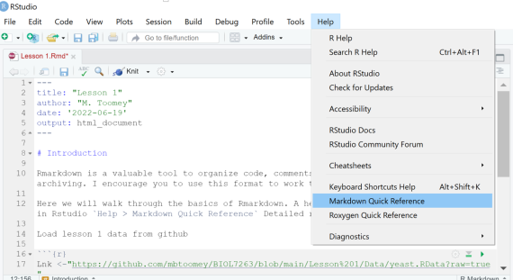

# Working with Rmarkdown

## Introduction

Markdown is a valuable tool to organize code, comments, and output for communication and archiving. I encourage you to use this format to work through our lessons and take notes. 

Here we will walk through the basics of Markdown. A helpful quick references is available in Rstudio `Help > Markdown Quick Reference`:



A more detailed reference is available at the [rmarkdown cookbook](https://bookdown.org/yihui/rmarkdown-cookbook/).


### Basic text formatting
- headers `#` to `######`
    *numbering from options
- text
- markup
    * italic `*<text>*`
    * bold-face `**<text>**`
    * subscript `~<text>~`
    * superscript `^<text>^`
    * strikethrough `~~<text>~~`
    * quotations `><text with no closing mark`
    
### Spacing
- Regular text is single spaced
- double spacing sets a line break (or carriage return)
    
### Insert links and images   
- links 

```
[Dr. Toomey's website](http://mbtoomey.net)
```
[Dr. Toomey's website](http://mbtoomey.net)

```
[My sbatch file](https://github.com/mbtoomey/genome_biology_FA24/blob/main/CourseMaterials/template.sbatch)
````
[My sbatch file](https://github.com/mbtoomey/genome_biology_FA24/blob/main/CourseMaterials/template.sbatch)

- images 
```

```


### Lists 

#### unordered list
```
- Finches
- Sparrows
    - House sparrow
    - Tree sparrow
```    
For second level list items "-" is preceeded by two spaces

- Finches
- Sparrows
    - House sparrow
    - Tree sparrow


#### Order lists  
```    
1. Finches
2. Sparrows
    - House sparrow
    - Tree sparrow
```    
1. Finches
2. Sparrows
    - House sparrow
    - Tree sparrow
    
# Fencing
```
Anything surrounded by backticks `will render as plain text` 
```
Anything surrounded by backticks `will render as plain text` 
```{r eval=FALSE}
R code inside ticks can be executed during rendering. For example, you can caluclate a value `r 3 + pi`. 
```
R code inside ticks can be executed during rendering. For example, you can caluclate a value `r 3 + pi`.

You can create a whole block of plain text by surrounding it with three backticks

```
everything is plain text here.
even single lines

Useful for show blocks of codes
```

# Block quotes with `>`

```
> Whether I shall turn out to be the hero of my own life, or whether that station will be held by anybody else, these pages must show.
```

> Whether I shall turn out to be the hero of my own life, or whether that station will be held by anybody else, these pages must show.

# Spacer line with three or more underscores
```
___   
```

___
# Tables

```
| Species  | Awesomeness
| :------------- | :-------------
| House Sparrow   | Medium|
| Tree Sparrow  | High|
```

| Species  | Awesomeness
| :------------- | :-------------
| House Sparrow   | Medium|
| Tree Sparrow  | High|

The "-" separates the header from the rest of the column
The ":" set the justification

### Emojis :partying_face:

You can add :grinning: :boom: :man_farmer: to your markdown! You do this by typing the Unicode Common Locale Data Repository emoji name between ":" e.g. `:two_hearts:` :two_hearts:. A listing of the avialable emojis can be found [here](https://github.com/ikatyang/emoji-cheat-sheet?tab=readme-ov-file).


### Equations

* in-line `$`
* centered `$$`

- basic math and text spacing handled by LateX. Note that this language is a bit different than the basic markdown (e.g. how sub and superscripts are handled)

```
$$y = a + b$$
```

$$y = a + b$$

#### Subcripts

```
$$H_0 = Z_{a + b}$$
```

$$H_0 = Z_{a + b}$$

#### Superscripts

```
$$S = cA^z$$

```

$$S = cA^z$$


- elements can be coupled and nested

$$S=cA^z_1 + z_{2 + x}$$


```
$$S=cA^z_1 + z_{2 + x}$$

```

#### Fractions and Greek Symbols

$$\alpha = \frac{\beta}{\delta + \gamma_x}$$
```
$$\alpha = \frac{\beta}{\delta + \gamma_x}$$

```

#### Summation signs

$$z = \sum_{i=1}^X{K}$$

```
$$z = \sum_{i=1}^X{K}$$

```

#### What if you need a backslash in your equation? 

Use `\backslash`

```
$$\backslash \alpha \le b \backslash$$

```

$$\backslash \alpha \le b \backslash$$

#### Rendering plain text in a LaTex Equation

$$P(Expression of gene) = Z$$
```
$$P(Expression of gene) = Z$$
```

$$P(\mbox{Expression of gene}) = Z$$

```
$$P(\mbox{Expression of gene}) = Z$$

```
